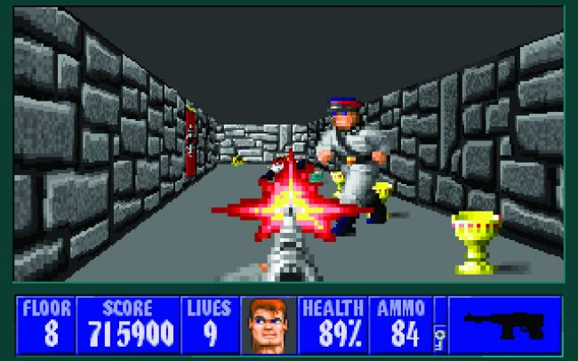

```{r setup, include=FALSE, message=FALSE, warning=FALSE}
knitr::opts_chunk$set(echo = FALSE)
knitr::opts_chunk$set(message = FALSE)
knitr::opts_chunk$set(warning = FALSE)
knitr::opts_chunk$set(out.width = "100%")
knitr::opts_chunk$set(dpi = 300)

library(readr)
library(ggplot2)
library(dplyr)
library(ggmap)
library(viridis)
library(forcats)
library(smodels)
```

## Introduction

In this report, I will explore a dataset of 100 video game titles published by four different AAA game studios: Ubisoft, Nintendo, Electronic Arts, and Square Enix. 

Moreover, I developed three hypotheses about this data:

1) IGN scores will generally tend to increase with later year releases.

2) IGN scores will tend to be higher for Nintendo games than for games published by the other studios.

3) Games published in more recent years will tend to more often have ESRB ratings of M.

## Methods

  To begin, I chose to look at four different popular AAA game studios: Ubisoft, Nintendo, Electronic Arts, and Square Enix. These game studios have published numerous famous game titles and were established long enough in the past that I would be able to find enough titles for each to equally record some number of games by the respective publishers as well as the year in which the titles were published. I then did a general google search for the titles published by each of these game studios and recorded 25 game titles per studio. The game title is represented by the character variable "name" in the dataset, the publisher of the game is represented by the character variable "publisher", and the year that the game was published is represented by the numeric variable "release_year" (YYYY). I proceeded to record the ESRB (Entertainment Software Rating Board) rating of each of these game titles (for our purposes, M (Mature), T (Teen), or E (Everyone)) through the ESRB website search feature (http://www.esrb.org/ratings/). The ESRB rating of the game titles are represented by the character variable "esrb_rating" in the dataset. Additionally, I recorded the overall game quality ratings found on IGN (http://www.ign.com/) for the titles. IGN ratings are on a scale of 0.1 - 10.0, where 10 is the best overall quality and 0.1 is the worst overall quality. These ratings increment by 0.1 and are "written by a dedicated professional who has spent a qualified number of hours playing a game". The IGN rating of the game titles are represented by the numeric variable "ign_rating" in the dataset.

## Results

```{r}
games <- read_csv("https://raw.githubusercontent.com/urstats/stat209-s18-RyanAJennings/master/project_c/game_data.csv")
esrb_M_games <- filter(games, esrb_rating == "M")
sum_M_games <- group_summarize(esrb_M_games, release_year)
```

To explore my first hypothesis, that IGN scores will generally tend to increase with later year releases, I will construct a linear regression between the release_year and ign_rating variables of the dataset. The reasoning behind my hypothesis is that game quality (especially in terms of graphics and complexity) has increased exponentially over the past 20 years, making it potentially challenging to rate older games in the context of the time it was released if they are not properly recorded around that same time.

```{r}
model <- lm_basic(ign_rating ~ 1 + release_year, data = games)
reg_table(model, level = 0.95)
```
```{r}
ggplot(games, aes(release_year, ign_rating)) + 
  geom_point(aes(color = publisher)) + 
  geom_smooth(method = "lm", color = "red") + 
  xlab("Release Year") + 
  ylab("IGN Rating") 
```


According to the regression table and graph above, I can conclude that there is no significant statistical difference between the IGN ratings of the games as a function of their release dates. The confidence interval includes 0, with a lower bound of -0.052286 and a higher bound of 0.041, leading to the conclusion that there is no significant relationship between the two variables. This is also visible in the graph above, which shows that although the majority of points are concentrated at or above an IGN rating of 8 from 2010 thru present, there are not enough data points in earlier years (1990 - 2000) to safely determine a connection.

I will explore my next hypothesis, that IGN scores will tend to be higher for Nintendo Games than for games published by the other studios, with the following regression table. The reasoning behind this hypothesis rests in subjective assumptions about the views that people hold of Nintendo games, being a highly respected game studio with the best-known and top-selling game titles. To give a Nintendo game a poor rating may be more daring than to give a game from Square Enix or Ubisoft a low rating.

```{r}
games$pub_new <- fct_relevel(games$publisher, "Nintendo")
model <- lm_basic(ign_rating ~ 1 + pub_new, data = games)
reg_table(model, level = 0.95)
```

```{r}
ggplot(games, aes(publisher, ign_rating)) + 
  geom_boxplot() + 
  xlab("Publisher") + 
  ylab("IGN Rating")
```

According to this regression table and the graph above, I can conclude that my hypothesis can be accepted when considering Square Enix and Ubisoft titles only, however must be rejected when considering Electronic Arts titles. The confidence interval indicated for Electronic Arts when compared to the IGN scores of Nintendo games includes 0, with a lower bound of -1.248 and an upper bound of 0.128. The confidence intervals for Square Enix and Ubisoft, however, have both negative lower bounds and negative upperbounds. This means that the mean IGN score for Square Enix and Ubisoft titles are, with 95% confidence, lower than the mean IGN score for Nintendo games by about 0.856 and 0.864 points respectively.

Lastly, I will explore my third hypothesis which states that games published in more recent years will tend to more often have ESRB ratings of M. This hypothesis is based in the observation that the most popular games of recent years have leaned toward the genre of first-person shooter (FPS) games such as Call of Duty, Counter Strike, Fallout, and similar titles. FPS games are almost unanimously rated M due to violence and gore. As mentioned previously, game graphics have made great strides in the past 20 years, which allows for more realistic (and arguably disturbing) depictions of violence, leading to more government restrictions over the purchase of these games - largely handled by the ESRB ratings. To illustrate my point, below are images of the game Wolfenstein in an earlier release (1992) and a more recent release (2017).


{ width=50% }{ width=50% }


```{r}
model <- lm_basic(n ~ 1 + release_year, data = sum_M_games)
reg_table(model, level = 0.95)
```

```{r}
ggplot(sum_M_games, aes(release_year, n)) +
  ylab("Number of M-rated Games") + 
  xlab("Release Year") +
  geom_point(aes(color = n)) + 
  geom_smooth(method = "lm", color = "red") + 
  labs(color = "Number of M-rated Games") 
```

According to the above regression table and plot, it can be said with 95% confidence that the number of M-rated games increase by approximately 0.2497 per year. The confidence interval does not include 0 (with a lower bound of 0.06287 and an upper bound of 0.437), which means that the relationship between the number of M-rated games and the release years have a statistically significant relationship - as the years progress, a statistically significant increase in the number of M-rated games can be observed.

## Conclusions

My first hypothesis, that IGN scores will generally tend to increase with later year releases, was proven to be unsupported given this dataset. It was concluded that there is no significant statistical relationship between the IGN score and the release year of a game, evidenced by a confidence interval of (-0.052286, 0.041), which includes the value 0. This information was reaffirmed in the graph, which showed a regression line with a slope that is nearly 0 and no obvious trend in the plotted points. As noted earlier in the report, I would need a larger dataset, espeically containing more data points in early years (1990 - 2000), to further examine if this hypothesis is true. However, with the current dataset, there is no significant relationship between the IGN score and release year of a game.

My second hypothesis, that IGN scores will tend to be higher for Nintendo games than for games published by the other studios, was partially supported by the data analysis. The regression table showed that there was a statistically significant difference between the IGN scores of Nintendo games and Square Enix and Ubisoft. The confidence intervals for Square Enix and Ubisoft when compared to Nintendo, however, have both negative lower bounds and negative upper bounds, meaning that they do not include 0 and thus have statistically different IGN scores on average. When compared to Nintendo games, Square Enix games differ in IGN score by approximately -0.856 points, while Ubisoft games differ in IGN score by approximately -0.864. However, the regression table also showed that there is no statistically significant difference between the IGN scores of Nintendo games and Electronic Arts games. As previously stated, the confidence interval when comparing the IGN scores of Nintendo and Electronic Arts games includes 0, with a lower bound of -1.248 and an upper bound of 0.128. The corresponding box plot shows this information graphically, indicating that Nintendo has a higher median IGN score than all other publishers, a strong overlap in upper and lower quartiles with Electronic Arts, and slight overlaps in upper and lower quartiles with Square Enix and Ubisoft. Considering these intervals given by the regression table along with the box plot, it can be concluded that the hypothesis can be accepted when considering publishers Square Enix and Ubisoft, but rejected when considering Electronic Arts.

My third and final hypothesis states that games published in more recent years will tend to more often have ESRB ratings of M. The regression table showed that there was a statistically significant relationship between the frequency of M-rated games and their release years that matched with my initial hypothesis. As stated in the analysis, it can be observed with 95% confidence that the number of M-rated games increase by approximately 0.2497 per year. This is supported through the confidence interval that, with a lower bound of 0.06287 and an upper bound of 0.43, does not include 0. This conclusion is further supported by the graph, which includes a regression line with an obvious positive slope, showing the general increase over time. Though the hypothesis can be accepted, it is important to note that the dataset lacked data from earlier years (1990-2000), and had an excess of data in later/more recent years. This is mainly due to the fact that IGN scores are more frequently recorded for recent releases and exclude scores for games from earlier years. The conclusions made in this report are not fully reflective of the reality of game ratings and the relationships between them.

## References

http://www.esrb.org/ratings/ \\
http://www.ign.com/ \\
https://web.archive.org/web/20090420090706/http://games.ign.com/ratings.html \\
https://www.pcgamer.com/the-history-of-the-first-person-shooter/ \\
https://wolfenstein.bethesda.net/

